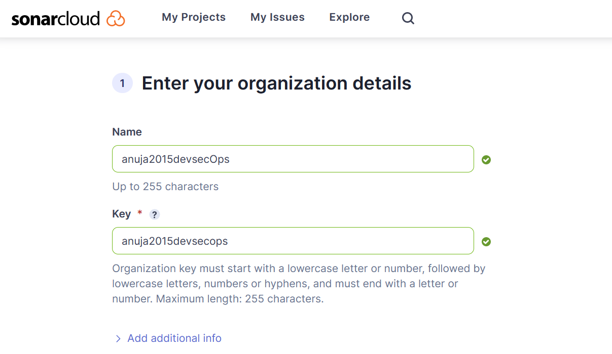
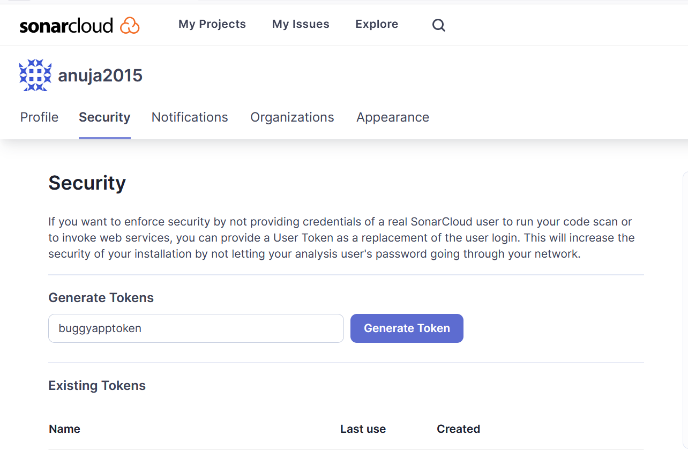
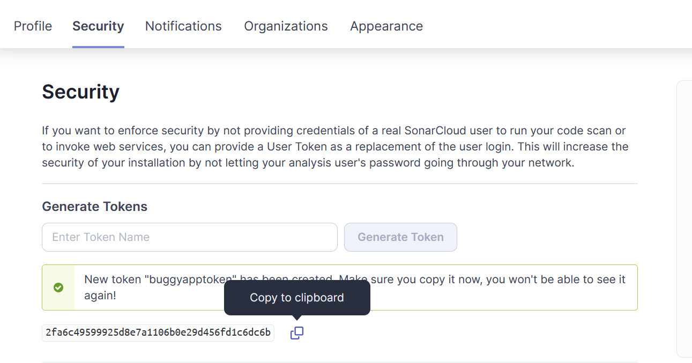
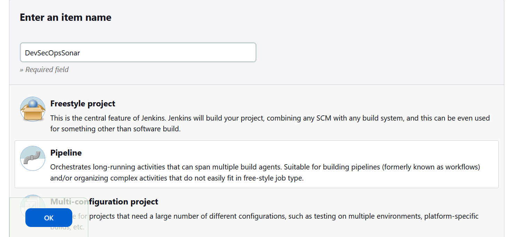
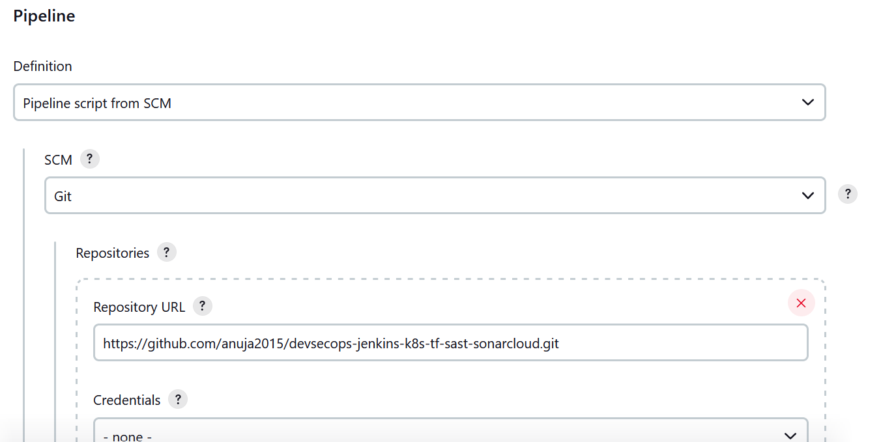
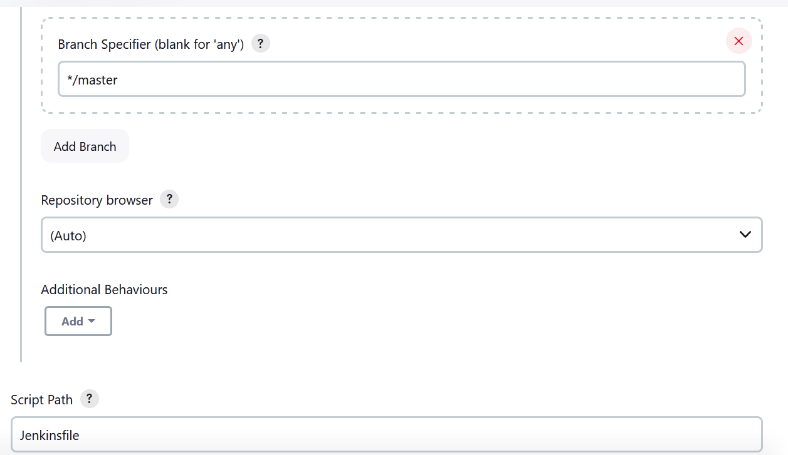
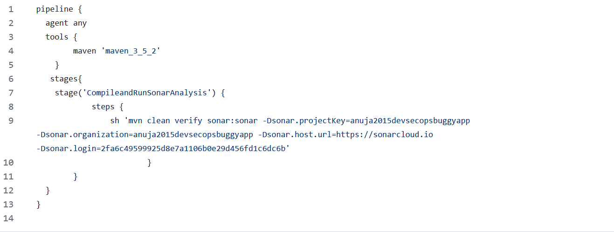
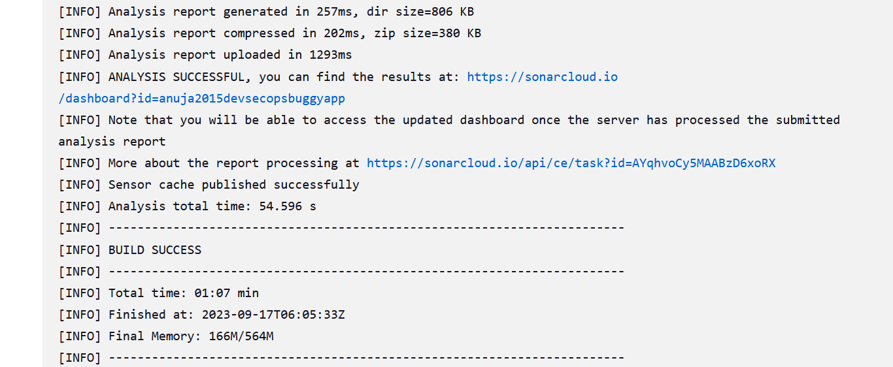
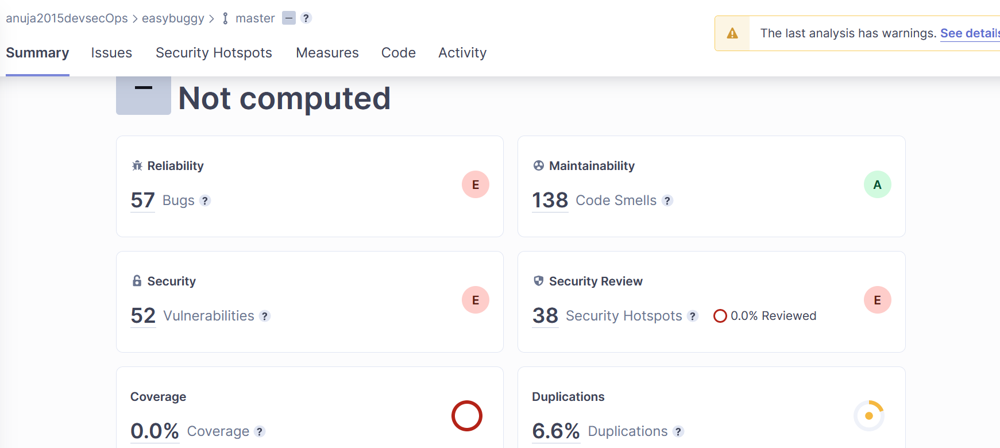

## SonarCloud and SonarQube

SonarCloud and SonarQube are two products from SonarSource that help developers find and fix issues in their code, such as bugs, vulnerabilities, code smells, duplications, and more.

__SonarCloud__

- Cloud based service that integrates with cloud platforms like GitHub, Bitbucket, Azure DevOps, GitLab, and Jenkins.

- Keeps our source code free from code quality issues and code security issues.

- SonarCloud is free for open source projects and has a usage-based pricing model for private projects.

Benefits: 

  **i.** Quality gates : We can define quality criteria for our code based on metrics like bugs, vulnerabilities, code smells, coverage, duplications, etc.

  **ii.** Secure code: We can detect and fix security issues in our code before they become exploitable by attackers.

  **iii.** Clean code: We can improve the readability, maintainability, and testability of our code by following best practices and coding standards.

__SonarQube__

- self-managed solution that you can install on your own servers or in a self-managed cloud environment.

- SonarQube offers a free open source version and a yearly subscription for the enterprise version, which includes additional features like branch analysis, portfolio management, security reports, and more.

#### When to use SonarQube and SonarCloud

1. **Code hosting platform**

Cloud platform - SonarCloud is the easiest option

On-premise platform - SonarQube

2. **security and compliance requirements**

If you need to have full control over your data and meet specific security and compliance standards -  SonarQube gives you more flexibility and customization options.

If you are comfortable with trusting a third-party provider with your data and rely on their security measures - SonarCloud can save you time and resources.

3. **budget and resources**

Limited budget or resources to maintain your own servers or databases - SonarCloud can be a cost-effective.
Enough budget and resources to invest in your own infrastructure and support - SonarQube can give you more stability and performance.

## Create an account with SonarCloud


Login using GitHub account.

## Integrate SonarCloud with Jenkins Pipeline

1. SonarCloud needs a few inputs.

    i.  projectKey
    ii. organization
    iii. hosturl
    iv.  logintoken
We get all these from sonarcloud dashboard.

SonarCloud Dashboard -> + -> Create new organization -> create manually -> Enter the details -> Select Free Plan -> Create



SonarCloud Dashboard -> + -> Analyze new project -> Create new project -> set up.

SonarCloud Dashboard -> Profile icon -> Account -> Security -> Generatetoken






2. Create Jenkins Pipeline Job



3. Configure the Job





4. Edit Jenkinsfile and commit



5. Build the Job



6. Got to project in sonarcloud dashboard and see the report.




# EasyBuggyApp

[](https://travis-ci.org/k-tamura/easybuggy)
[](https://opensource.org/licenses/Apache-2.0)
[](https://github.com/k-tamura/easybuggy/releases/latest)

EasyBuggy Vulnerable Web App Modified by A Security Guru :baby_symbol:
=

EasyBuggy is a broken web application in order to understand behavior of bugs and vulnerabilities, for example, [memory leak, deadlock, JVM crash, SQL injection and so on](https://github.com/k-tamura/easybuggy#clock4-easybuggy-can-reproduce).


:clock4: Quick Start
-

    $ mvn clean install

( or ``` java -jar easybuggy.jar ``` or deploy ROOT.war on your servlet container with [the JVM options](https://github.com/k-tamura/easybuggy/blob/master/pom.xml#L204). )

Access to

    http://localhost:8080

:clock4: Quick Start(Docker)
-

    $ docker build . -t easybuggy:local # Build container image
    $ docker run -p 8080:8080 easybuggy:local # Start easybuggy

Access to

    http://localhost:8080

### To stop:

  Use <kbd>CTRL</kbd>+<kbd>C</kbd> ( or access to: http://localhost:8080/exit )

:clock4: For more detail
-
   
See [the wiki page](https://github.com/k-tamura/easybuggy/wiki).

:clock4: Demo
-

This demo shows: Start up -> Infinite Loop -> LDAP Injection -> UnsatisfiedLinkError -> BufferOverflowException -> Deadlock -> Memory Leak -> JVM Crash (Shut down)


:clock4: EasyBuggy can reproduce:
-

* Troubles

  * Memory Leak (Java heap space)
  * Memory Leak (PermGen space)
  * Memory Leak (C heap space)
  * Deadlock (Java)
  * Deadlock (SQL)
  * Endless Waiting Process
  * Infinite Loop
  * Redirect Loop
  * Forward Loop
  * JVM Crash
  * Network Socket Leak
  * Database Connection Leak
  * File Descriptor Leak 
  * Thread Leak 
  * Mojibake
  * Integer Overflow
  * Round Off Error
  * Truncation Error
  * Loss of Trailing Digits

* Vulnerabilities

  * XSS (Cross-Site Scripting)
  * SQL Injection
  * LDAP Injection
  * Code Injection
  * OS Command Injection (OGNL Expression Injection)
  * Mail Header Injection
  * Null Byte Injection
  * Extension Unrestricted File Upload
  * Size Unrestricted File Upload
  * Open Redirect
  * Brute-force Attack
  * Session Fixation Attacks
  * Verbose Login Error Messages
  * Dangerous File Inclusion
  * Directory Traversal
  * Unintended File Disclosure
  * CSRF (Cross-Site Request Forgery)
  * XEE (XML Entity Expansion)
  * XXE (XML eXternal Entity)
  * Clickjacking

* Performance Degradation

  * Slow Regular Expression Parsing
  * Delay of creating string due to +(plus) operator
  * Delay due to unnecessary object creation

* Errors

  * AssertionError
  * ExceptionInInitializerError
  * FactoryConfigurationError
  * GenericSignatureFormatError
  * NoClassDefFoundError
  * OutOfMemoryError (Java heap space) 
  * OutOfMemoryError (Requested array size exceeds VM limit)
  * OutOfMemoryError (unable to create new native thread)
  * OutOfMemoryError (GC overhead limit exceeded)
  * OutOfMemoryError (PermGen space)
  * OutOfMemoryError (Direct buffer memory)
  * StackOverflowError
  * TransformerFactoryConfigurationError
  * UnsatisfiedLinkError

:clock4: EasyBuggy clones:
-
* [EasyBuggy Boot](https://github.com/k-tamura/easybuggy4sb)

  EasyBuggy clone build on Spring Boot

  

* [EasyBuggy Bootlin](https://github.com/k-tamura/easybuggy4kt)

  EasyBuggy clone build on Spring Boot and written in Kotlin

  

* [EasyBuggy Django](https://github.com/k-tamura/easybuggy4django)

  EasyBuggy clone build on Django 2 and written in Python

  　
